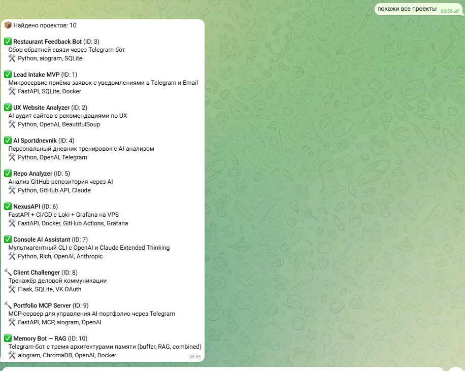
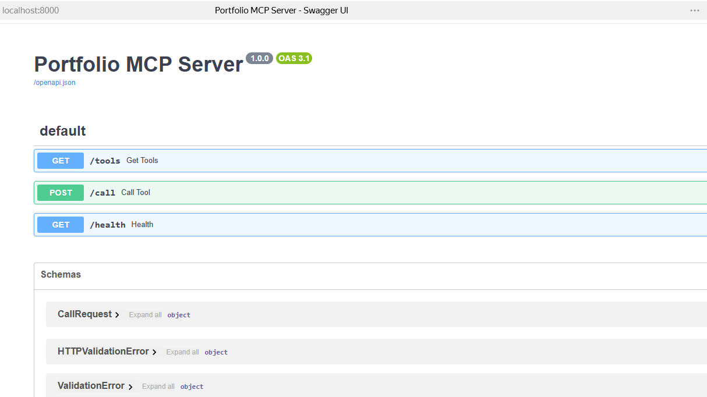
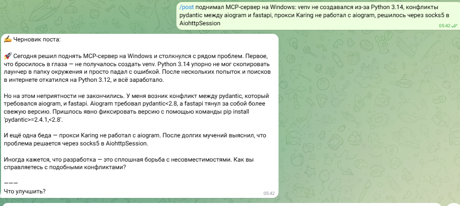

# Portfolio MCP — AI-ассистент для управления портфолио

MCP-сервер на FastAPI + Telegram-бот для управления портфолио AI-проектов.  
Адаптация учебного MCP-проекта под реальную задачу: отслеживать свои проекты, их статусы и накапливать идеи для постов в канал.

---

## Архитектура

```
Telegram-бот
    ↓ сообщение пользователя
GPT-4o-mini (ProxyAPI)
    ↓ выбирает нужный инструмент → JSON
MCP-клиент (HTTP)
    ↓ POST /call
FastAPI MCP-сервер (localhost:8000)
    ↓
SQLite (portfolio.db)
```

Все файлы лежат в одной папке (плоская структура):

```
portfolio_mcp/
├── .env                  # токены и настройки (создать из .env.example)
├── .env.example
├── server.py             # FastAPI MCP-сервер
├── db.py                 # SQLite, инициализация, сид-данные
├── tools.py              # инструменты + MCP JSON Schema
├── bot.py                # aiogram 3.x бот + OpenAI
├── mcp_client.py         # HTTP-клиент к MCP-серверу
├── config.py             # переменные окружения
├── requirements.txt
└── portfolio.db          # создаётся автоматически при первом запуске
```
## Скриншоты

### Бот в работе


### API документация


### Генерация поста

---

## Быстрый старт (Windows / PowerShell)

### 1. Переменные окружения

```powershell
Copy-Item .env.example .env
notepad .env
```

Заполни:

```env
TELEGRAM_TOKEN=токен_от_BotFather
OPENAI_API_KEY=ключ_от_ProxyAPI          # proxyapi.ru, не openai.com напрямую
OPENAI_BASE_URL=https://api.proxyapi.ru/openai/v1
MCP_SERVER_URL=http://localhost:8000
SOCKS5_PROXY=socks5://127.0.0.1:2080     # порт Karing — проверь в настройках приложения
```

### 2. Создать venv и установить зависимости

```powershell
py -3.12 -m venv venv
venv\Scripts\activate
venv\Scripts\python.exe -m pip install -r requirements.txt
```

### 3. Запустить MCP-сервер (первый терминал)

```powershell
venv\Scripts\python.exe server.py
# Сервер запустится на http://localhost:8000
# База данных создастся автоматически и заполнится тестовыми проектами
```

### 4. Запустить бота (второй терминал)

```powershell
venv\Scripts\activate
venv\Scripts\python.exe bot.py
```

> **Важно:** каждый раз при открытии нового терминала активируй venv командой `venv\Scripts\activate`. Бот и сервер работают в двух параллельных терминалах одновременно.

---

## Инструменты MCP

| Инструмент | Параметры | Описание |
|---|---|---|
| `list_projects` | `status` (опц.) | Все проекты. Фильтр по статусу: `idea`, `in_progress`, `done`, `paused` |
| `find_project` | `query` | Поиск по названию, описанию или стеку технологий |
| `add_project` | `name`, `description`, `stack`, `status`, `github_url` | Добавить новый проект |
| `update_project_status` | `project_id`, `status` | Сменить статус проекта по ID |
| `get_stats` | — | Статистика: сколько проектов по каждому статусу, кол-во идей для постов |
| `add_post_idea` | `idea`, `project_id` (опц.) | Сохранить идею для поста в канал |
| `list_post_ideas` | — | Список всех сохранённых идей для постов |
| `calculate` | `expression` | Безопасный калькулятор на Python AST (без eval) |

---

## Команды бота

| Команда | Описание |
|---|---|
| `/start` | Приветствие и список возможностей |
| `/stats` | Быстрая статистика портфолио |
| `/ideas` | Список идей для постов |
| `/clear` | Очистить историю диалога |

Бот хранит историю диалога (последние 20 сообщений), поэтому контекст не теряется между запросами.

---

## Примеры запросов

```
покажи все проекты
что сейчас в работе?
найди проекты на FastAPI
найди проекты на Docker
добавь идею: пост про архитектуру MCP
покажи идеи для постов
переведи проект 3 в done
добавь проект: название "AI Summarizer", стек Python/OpenAI, статус idea
статистика
сколько будет 1500 * 12
```

---

## Особенности реализации

- **ProxyAPI** — используется вместо прямого OpenAI API, базовый URL задаётся в `.env`
- **Karing (SOCKS5)** — весь внешний трафик (Telegram API, ProxyAPI) идёт через локальный прокси
- **Безопасный калькулятор** — парсинг через Python AST вместо `eval()`, исключает выполнение произвольного кода
- **Сид-данные** — при первом запуске база заполняется реальными проектами из портфолио
- **Масштабируемость** — к одному MCP-серверу можно подключить несколько ботов или агентов без переписывания инструментов

---

## Стек

`Python 3.12` · `FastAPI` · `SQLite` · `aiogram 3.x` · `OpenAI GPT-4o-mini` · `ProxyAPI` · `httpx` · `aiohttp-socks`
